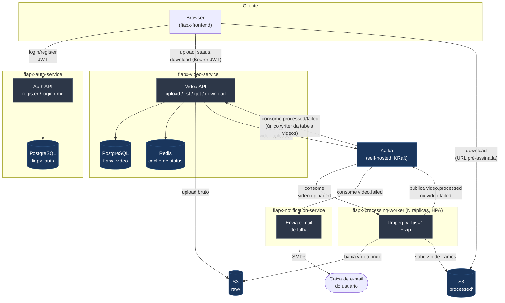

# Arquitetura — FIAP X, Sistema de Processamento de Vídeos

Documentação da arquitetura proposta para o desafio da Hackathon SOAT
(Fase 5, POSTECH). Complementa o [README](../README.md) deste repo (que
cobre como provisionar/rodar) — aqui é o "porquê" e o "como se encaixa".

## Contexto do desafio

O projeto base entregue pela banca é um monolito Go de um arquivo só:
`POST /upload` roda `ffmpeg -vf fps=1` **de forma síncrona e bloqueante**
dentro da própria requisição HTTP, zipa os frames e devolve tudo na
mesma chamada. Sem autenticação, sem fila, sem persistência (só
filesystem local), sem testes, sem CI/CD.

O desafio pede pra resolver exatamente essas lacunas com uma arquitetura
de microsserviços, orientada a eventos, escalável — sem prescrever o
desenho exato, só os requisitos funcionais/técnicos e uma stack
recomendada (fica a critério do grupo).

## Diagrama de arquitetura

## Decomposição em serviços

| Repositório | Responsabilidade | Persistência própria |
|---|---|---|
| [`fiapx-auth-service`](https://github.com/noggrj/hacktown-fase-5-auth-service) | Cadastro/login por usuário e senha, emissão de JWT (HS256, 24h) | PostgreSQL |
| [`fiapx-video-service`](https://github.com/noggrj/hacktown-fase-5-video-service) | Upload, listagem/status, download; único *writer* da tabela `videos` | PostgreSQL + Redis (cache) |
| [`fiapx-processing-worker`](https://github.com/noggrj/hacktown-fase-5-processing-worker) | Consome `video.uploaded`, roda ffmpeg de verdade, zipa, sobe pro S3 | — (idempotência via Redis) |
| [`fiapx-notification-service`](https://github.com/noggrj/hacktown-fase-5-notification-service) | Consome `video.failed`, envia e-mail real via SMTP | — (idempotência via Redis) |
| [`fiapx-events`](https://github.com/noggrj/hacktown-fase-5-events) | Contratos de evento compartilhados (Go module, tag `v1.0.0`), idempotência, transporte Kafka | — |
| [`fiapx-frontend`](https://github.com/noggrj/hacktown-fase-5-front-end) | SPA React: login, upload com progresso, status ao vivo (polling), download | — (sem estado; JWT em `localStorage`) |
| **fiapx-infra** (este repo) | Terraform (AWS) + Helm (Kafka/Redis/Prometheus/Ingress) + `docker-compose` local | — |

Cada serviço Go segue Clean Architecture (domain/usecase/delivery/gateway),
com `/health` e `/ready` reais (checam Postgres/Kafka/Redis/S3 de verdade
a cada chamada, não só na inicialização).

## Fluxo do vídeo, evento a evento

1. Usuário se registra/loga no **Auth Service** → recebe um JWT.
2. `POST /videos` no **Video Service** (Bearer JWT): sobe o vídeo bruto
   pro S3 (`raw/{video_id}/...`), grava a linha em `videos` (status
   `PENDING`), publica `video.uploaded` no Kafka e responde **202
   Accepted** — não bloqueia esperando o processamento.
3. **Processing Worker** (múltiplas réplicas = mesmo consumer group,
   paraleliza por partição) consome `video.uploaded`: baixa o vídeo,
   roda `ffmpeg -vf fps=1`, zipa os frames, sobe o zip
   (`processed/{video_id}.zip`), publica `video.processed` ou
   `video.failed`.
4. **Video Service** consome `video.processed`/`video.failed` (único
   *writer* da tabela) e atualiza o status; invalida o cache Redis do
   usuário dono do vídeo.
5. **Notification Service** consome `video.failed` e envia e-mail.
6. Usuário consulta `GET /videos` (status, lido do Redis com *fallback*
   Postgres) e `GET /videos/{id}/download` (URL pré-assinada do S3,
   só quando `status=DONE`).

### Contratos de evento

| Evento | Publisher | Consumers | Payload principal |
|---|---|---|---|
| `video.uploaded` | Video Service | Processing Worker | `videoId`, `userId`, `userEmail`, `s3RawKey` |
| `video.processed` | Processing Worker | Video Service | `videoId`, `s3ZipKey`, `frameCount` |
| `video.failed` | Processing Worker | Video Service, Notification Service | `videoId`, `userId`, `userEmail`, `reason` |

Kafka é *at-least-once* — cada consumer grava o `eventId` (UUID) numa
tabela/registro `processed_events` (idempotência) antes de agir, pra não
duplicar atualização de status ou envio de e-mail em caso de redelivery.

## Requisitos do desafio → como foram atendidos

| Requisito (PDF do desafio) | Como é atendido |
|---|---|
| Processar mais de um vídeo ao mesmo tempo | Kafka desacopla ingestão de processamento; Processing Worker roda com **N réplicas no mesmo consumer group** (paraleliza por partição) + HPA |
| Não perder requisição em pico | `POST /videos` grava no Postgres e responde 202 **antes** de qualquer processamento pesado; Kafka funciona como buffer durável entre ingestão e processamento — um pico de upload não derruba o ffmpeg, só enche a fila |
| Sistema protegido por usuário e senha | Auth Service (bcrypt + JWT HS256); todas as rotas de negócio do Video Service exigem Bearer token válido |
| Listagem de status dos vídeos de um usuário | `GET /videos` (Video Service), com poll automático no frontend enquanto houver vídeo não-terminal |
| Notificação de erro | Notification Service consome `video.failed` e envia e-mail real (testado ponta a ponta via Mailpit) |
| Persistência de dados | PostgreSQL dedicado por serviço com dado próprio (Auth, Video); scripts de criação em `migrations/` de cada repo |
| Arquitetura escalável | Cada serviço é *stateless* e horizontalmente escalável (K8s Deployment + HPA no Video Service e no Worker — os dois pontos que realmente recebem carga variável) |
| Versionado no GitHub | 7 repositórios públicos, um por serviço + infra + frontend |
| Testes que garantam qualidade | Cobertura de lógica de negócio ≥ 70% (gate no CI) em todos os serviços Go; Vitest+RTL no frontend |
| CI/CD | GitHub Actions por repositório: lint, testes, gate de cobertura, build de imagem Docker |

## Decisões de arquitetura que valem registrar

| Decisão | Escolha | Por quê |
|---|---|---|
| Decomposição | 4 serviços de negócio (Auth, Video, Worker, Notification) + Events + Infra + Frontend | Auth isolado do domínio de vídeo; Worker e Notification como *consumers* puramente assíncronos, sem rota pública |
| Mensageria | Kafka self-hosted no próprio EKS (Helm, não gerenciado) | Evita depender de MSK, que pode não estar liberado/ser caro numa conta AWS Academy `voclabs` |
| Storage | S3 real (produção) / MinIO (local), prefixos `raw/` e `processed/` no mesmo bucket | Um bucket só, URLs pré-assinadas pro download direto sem proxiar bytes pelos serviços |
| Notificação | E-mail real via SMTP (Mailtrap/Gmail em produção, Mailpit local) | Demonstra o fluxo fim-a-fim de verdade sem a fricção de sandbox do SES (que exige verificar remetente **e** destinatário) |
| Cache | Redis só na listagem de status (`GET /videos`), invalidado por evento | Postgres continua sendo a fonte da verdade — Redis nunca vira dependência crítica |
| Gateway | Ingress NGINX simples, cada serviço valida o próprio JWT | Mais simples que Kong pro escopo do desafio; sem *fan-out* de lógica de auth num gateway central |
| Repositórios | Multi-repo, um por serviço | CI/CD isolado por serviço, mesmo padrão usado no restante do curso |

## Stack tecnológica

| Categoria | Escolha |
|---|---|
| Linguagem (backend) | Go 1.25 |
| Containers | Docker + Kubernetes (EKS) / Docker Compose (local) |
| Mensageria | Apache Kafka (self-hosted, KRaft, sem Zookeeper) |
| Banco de dados | PostgreSQL (Auth, Video) + Redis (cache/idempotência) |
| Storage de arquivo | AWS S3 (MinIO local) |
| Frontend | React 19 + TypeScript + Vite + TanStack Query |
| CI/CD | GitHub Actions |
| Observabilidade | Prometheus + Grafana (`kube-prometheus-stack`, via Helm) |
| IaC | Terraform (VPC, EKS, RDS×2, ECR, S3) + Helm (Kafka, Redis, Ingress, Prometheus) |

## Onde estão os scripts de criação do banco

- `fiapx-auth-service/migrations/0001_create_users.sql`
- `fiapx-video-service/migrations/0001_create_videos.sql`
- `fiapx-video-service/migrations/0002_create_processed_events.sql`

Aplicados automaticamente pelo Postgres (`docker-entrypoint-initdb.d`) no
`docker-compose` local; em produção, via Job de migration do Kubernetes
(ver `k8s/migrations/` neste repo).
